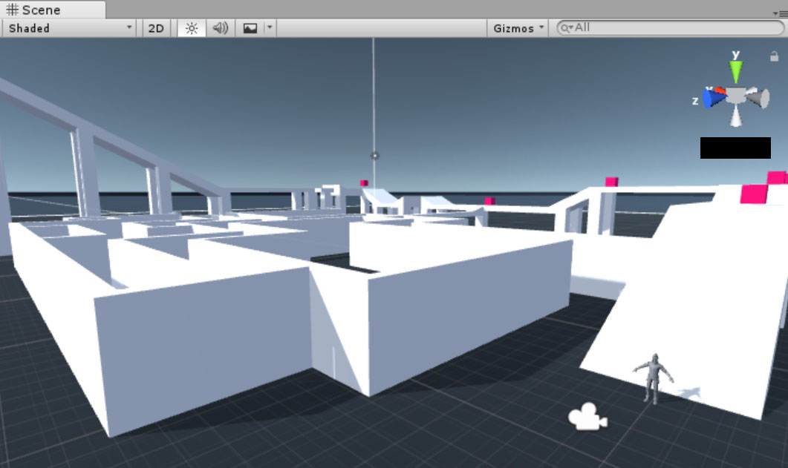
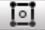

# 0x00. Unity - User Interface

What you'll find? This part of my Learning process is about:
- How to navigate the Unity interface
- What is the Scene view
- What is the Game view
- What is the Hierarchy window
- What is the Project window
- What is the Inspector window
- What is the Console window
- What is the Toolbar
- What are the Play Buttons
- What are the Transform tools
- What are the Collab, Services, Account buttons
- What are the Layers and Layouts dropdowns
- What are Gizmos

Here are the task I solve to answer those question and more. The solution to every task is on the file with the same name than the task.

My challenge for you is to try to solve all of this task and after see the way I did it.

All hotkey questions should be answered in all capital letters with `+` separating keystrokes. Use `CTRL/CMD` in your answer if the hotkey includes it. Examples: `CTRL/CMD + S`, `CTRL/CMD + SHIFT + C`, `F` Example:
```
$ cat 100-answer
2
$
```

#### 0. Project Window: Adding Assets
Which of the following is not a method of adding new assets or subfolders to a project?

1. Drag and drop the new asset to the Project window
2. `File` > `New Asset`
3. Click on the Create menu on the left side of the Project window’s toolbar

#### 1. Project Window: Filter Assets
What are the ways you can filter assets in the Project window toolbar?

1. by `Type` or `Label`
2. by `Name` or `Value`
3. by `Last Modified` or `Newest Created`

#### 2. Project Window: Hotkey
What is the hotkey to focus the Project window?

#### 3. Console Window: Hotkey
What is the hotkey to switch to the Console window?

#### 4. Scene view: X Axis
What direction does the X axis represent?

1. Left / Right
2. Forward / Backward
3. Up / Down

#### 5. Scene view: Y Axis
What direction does the Y axis represent?

1. Left / Right
2. Forward / Backward
3. Up / Down

#### 6. Scene View: Z Axis
What direction does the Z axis represent?

1. Left / Right
2. Forward / Backward
3. Up / Down

#### 7. Scene View: Perspective and Isometric views
You can toggle between Perspective and Isometric views by clicking the cube in the center of the Scene Gizmo.
A.

B.

Which scene is in Perspective mode and which scene is in Isometric mode?
1. `A` = Perspective, `B` = Isometric
2. `A` = Isometric, `B` = Perspective

#### 8. Scene View: Navigation Within Scenes
Which of the following is **not** a way to navigate within a scene?
1. Arrow keys
2. Flythrough mode
3. Pressing the `Play` button
4. Hand tool

#### 9. Scene View: Hotkey
What is the hotkey to focus the Scene view?

#### 10. Game View: Hotkey - Center
What is the hotkey for centering the view on a GameObject?

#### 11. Game View - Rendering view
Where does the Game view get it's rendered view from?
1. The view from the Scene view
2. The view from the player character
3. The cameres in the game

#### 12. Game View - Choose Camera
Which Game View toolbar menu lets you choose which camera to view from?
1. Aspect
2. Display
3. Camera

#### 13. Game View - Aspect Ratios
Which Game View toolbar menu lets you test how your game looks with different aspect ratios?
1. Screen
2. Display
3. Aspect

#### 14. Game View - Zoom
Which of the following is not a method of zooming in and out in the Game view?
1. Scroll wheel
2. Scale sleder
3. `+` and `-`

#### 15. Hierarchy Window: Order
What is the default order of objects listed in the Hierarchy window?
1. Order of creation
2. Alphabetical
3. Order of last modified

#### 16. Hierarchy Window: Reorder
Which of the following is **not** a way of reordering objects in the Hierarchy window?
1. Grouping objects as parent / child objhects
2. Modify their position number property in the Inspector
3. Dragging objects up and and down in the list

#### 17. Hierarchy Window: Parenting
What is Parenting in Unity?
1. Adding a parent template component to an object
2. Duplicating and object from another and linking them
3. Grouping objects where the topmost object is the parent and the objects grouped under it are the child objects.

#### 18. Hierarchy Window: Child Objects
How do you create a child object?
1. Write a script associating an object to it's parent object
2. Drag and drop child object onto parent object
3. Edit the child object's parent property in the Inspector

#### 19. Hierarchy Window: Hotkey
Whats is the hotkey for switching to the Hierarchy window?

#### 20. Inspector Window: GameObject Properties
How can you see the properties of a GameObject?
1. Right-click on the GameObject and choose `Properties` from the menu
2. Click on the GameObject gizmo
3. Select the GameObject in the Hierarchy window or Scene view the properties in the Inspectos window

#### 21. Inspector Window: Script Components
If a GameObject has a script component, which part of the script is displayed in the Inspector window?
1. Method name
2. Public variables
3. Return value

#### 22. Inspector Window: Multiple Windows
Can you have more than one Inspector window open at once?
1. Yes
2. No

#### 23. Inspector Window: Hotkey
What is the hotkey for switching to the Inspector window?

#### Toolbar: Rotate
Which Transform tool button rotates a GameObject?
1. 
2. 
3. 
4. 
5.  
6. 

#### 25. Toolbar: Pan
Which Transform tool button pans the Scene?
1. 
2. 
3. 
4. 
5.  
6. 

#### 26. Toolbar: Transform
Which Transform tool button combines the Move, Rotate, and Scale tools into a single Gizmo?
1. 
2. 
3. 
4. 
5.  
6. 

#### 27. Toolbar: Scale
Which Transform tool button scales a GameObject?
1. 
2. 
3. 
4. 
5.  
6. 

#### 28. Toolbar: Move
Which Transform tool button moves a GameObject?
1. 
2. 
3. 
4. 
5.  
6. 

#### 29. Toolbar: Transform 2D
Which Transform tool button combines the Move, Rotate, and Scale tools into a single Gizmo specifically for 2D games?
1. 
2. 
3. 
4. 
5.  
6. 

#### 30. Toolbar: View Arrangement
Which Toolbar dropdown controls the arrangement of all Views?
1. Layers
2. Layout
3. Account

#### 31. Toolbar: Displayed Objects
Which Toolbar dropdown controls which objects are displayed in the Scene view?
1. Layers
2. Layout
3. Account
