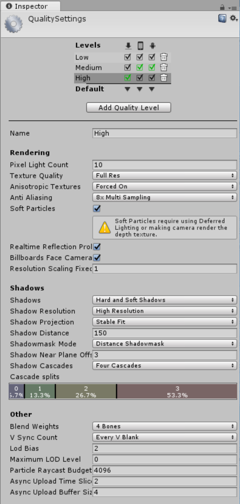

# 0x04-unity_publishing

What you'll find? This part of my Learning process is about:
- How to publish a build
- How to reorder scenes in a build
- How to build a standalone application for Windows, Mac, and Linux
- How to edit a project’s Quality Settings
- How to add an icon to your build
- What is the profiler and how to use it to check your project’s performance
- What to consider when developing for different platforms

Here are the task I solve to answer those question and more. The solution to every task is on the file with the same name than the task.

My challenge for you is to try to solve all of this task and after see the way I did it.

This is a project made on Unity 2019.3.0f6. If you have a different version of Unity, you can try to open the project and see if it works. If it doesn't, you can try to update your version of Unity.

This project have deploy to windows, linux and mac platform.

The link to my final result you can find it [here](https://drive.google.com/drive/folders/1G1Sr0mySkWDzC7PA6C1w_bkV3ej4zAQ9?usp=share_link)

All the intellectual property of this project is from Holberton School.

#### 0. Quality Settings
Clone your [`0x03-unity-ui`](https://github.com/bcondict/holbertonschool-0x03-unity-ui) repo into a new folder called `0x04-unity_publishing` inside your `holbertonschool-unity` repo.

In this project, you will be exploring how to publish a game to play on Windows, Mac, or Linux. If there are any changes or improvements you’d like to make to the `maze` in this repo, feel free! This project will only be checking your build settings and the final standalone game. If you do make changes to your `maze`, it’s strongly recommended to have a peer play it to make sure it works as intended.

Edit the project’s Quality Settings. Your project should have three quality levels:

**Low:**

**Medium:**

**High:**

#### 1. Player Settings
Edit the Player Settings for PC, Mac, & Linux Standalone. Unless otherwise specified below, leave settings with their default values. Create a new directory in the `Assets` folder called `Images`.

- Company Name: Your name
- Product Name: `Maze`
- Default Icon: Use [this image](https://s3.eu-west-3.amazonaws.com/hbtn.intranet.project.files/holbertonschool-cs-unity/423/mazeicon.png) or make your own (File name must be `mazeicon.png` and saved in directory `Assets/Images/`)
- Resolution and Presentation:

Resolution and Presentation:
- Default Is Full Screen: Off
- Default Screen Width: `1024`
- Default Screen Height: `768`
- Resizable Window: On

Splash Image:
- Splash Style: `Light on Dark`
- Animation: `Dolly`
- Draw Mode: `Unity Logo Below`
- Logos: Use [this image](https://s3.eu-west-3.amazonaws.com/hbtn.intranet.project.files/holbertonschool-cs-unity/423/mazelogo.png) or make your own (File name must be `mazelogo.png` and saved in directory `Assets/Images/`)
- Logo Duration: `4`

#### 2. Build Settings
**Scenes in Build:**
1. menu
2. maze
Create three builds of the `maze` in a directory called `Builds` in the root of your project folder (**not** inside the Assets folder).

- Windows and Linux builds should be set to `x86_64` architecture
- Do not check `Development Build`

**Build Folder Hierarchy:**
- Builds
    - Linux
        - Maze_Data
        - Maze.x86_64
    - Mac
        - Maze.app
    - Windows
        - Maze_Data
        - Maze.exe
        - UnityPlayer.dll
Make sure to run your build and make sure it works! It should open with the logo splash screen then the `menu`. Test your build on all three platforms if possible, but at the very least test on your own computer.

Create a `.zip` of each build:

- Maze_Mac.zip
- Maze_Linux_x86_64.zip
- Maze_Windows_x86_64.zip
- Upload the three `.zip` files to Google Drive or Dropbox. Add the links to the files below.
