# 0x05. Unity - Assets: Models, Textures

Skyboxes: Farland Skies - Cloudy Crown

What you'll find? This part of my Learning process is about:
- What is an Asset and how to import and use them
- How to use Asset Packages and the Unity Asset Store
- What are common Asset types
- How to use Unity primitives as placeholders to prototype a project
- What are materials and how to use them
- What are textures and how to use them
- What is a skybox
- What is are the components of a 3D model
- What is a mesh
- How to create UI elements with image components
- What is a Rigidbody and what is a Character Controller and what are the pros and cons of using each
- What is a Quaternion

Here are the task I solve to answer those question and more. The solution to every task is on the file with the same name than the task.

My challenge for you is to try to solve all of this task and after see the way I did it.

This is a project made on Unity 2019.3.0f6. If you have a different version of Unity, you can try to open the project and see if it works. If it doesn't, you can try to update your version of Unity.

The link to my final result you can find it [Here](https://drive.google.com/drive/folders/1Y4v5AfghbmpkjwsYBj0DWyLe011LaYKM?usp=share_link)

This project have deploy to windows, linux and mac platform.

All the intellectual property of this project is from Holberton School.

Resources, Read or watch:
[Skyboxes: Farland Skies - Cloudy Crown](https://assetstore.unity.com/packages/2d/textures-materials/sky/farland-skies-cloudy-crown-60004)
[Models: Kenney's Nature Pack Extended](https://kenney.nl/assets/nature-pack-extended)

#### 0. Primitive player
Create a new Scene called `Level01`. Create a capsule GameObject called `Player` which will be a placeholder for this project.

Position: `X: 0`, `Y: 1.25`, `Z: 0`
Rotation: `X: 0`, `Y: 0`, `Z: 0`
Scale: `X: 1`, `Y: 1`, `Z: 1`
Save `Player` as a Prefab into a folder named `Prefabs`. Make sure that when you make changes to the `Player` Prefab, you Apply the changes at the top of the Inspector window.

#### 1. Primitive prototype
In the `Level01` scene, create a layout of floating platforms of different sizes and positions using only Unity Cube GameObjects, . Plan for a start point and an endpoint and create a path so that the `Player` can jump between them. The cubes will be placeholders for 3D models that we will import later on.

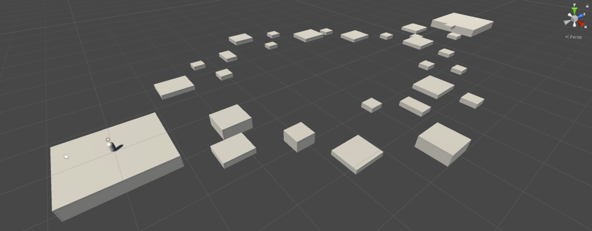

- We strongly suggest drawing out your level layout on paper or whiteboard before building it in Unity
- Create an empty GameObject called `Platforms` with a position of `X:0`, `Y:0`, `Z:0` and organize your platform GameObjects inside it
- The first platform should be positioned underneath the `Player`
- Feel free to create multiple paths or dead ends but keep the number of platforms under 30
- You may find it useful to use a top down or side view with the Scene Gizmo to position your platforms

#### 2. Pole position
At the end point of the platforms, create a placeholder cylinder GameObject called `WinFlag` to designate the end of the path. Do not make `WinFlag` a child of any object. Later we will add scripting for when the `Player` reaches the `WinFlag`.
- Capsule Collider:
    - `isTrigger`: Yes
    - `Radius`: `0.7`
    - `Height`: `6`

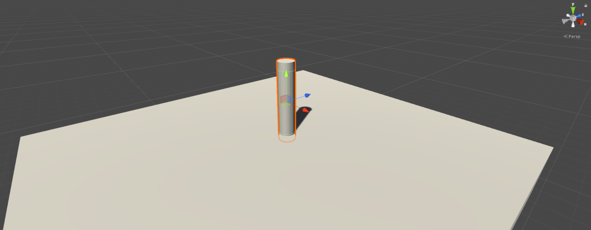

#### 3. Jump man
Create a new folder called `Scripts`. Inside that folder, create a new C# script called `PlayerController` and attach it to `Player`.

- The script should handle user input so the player can move left, right, forward, backward, and diagonally using the WASD keys
- The player should jump when the Space button is pressed

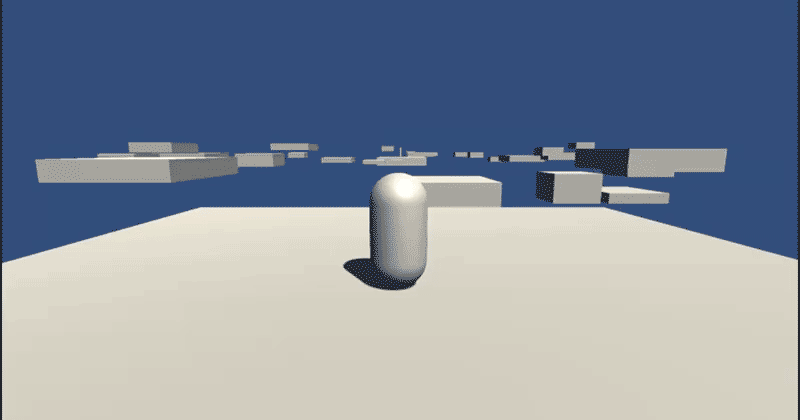

#### 4. Camera ready
Position the `Main Camera` at an offset behind the player.

Position: `X: 0`,` Y: 2.5`, `Z: -6.25`
Rotation: `X: 9`, `Y: 0`, `Z: 0`

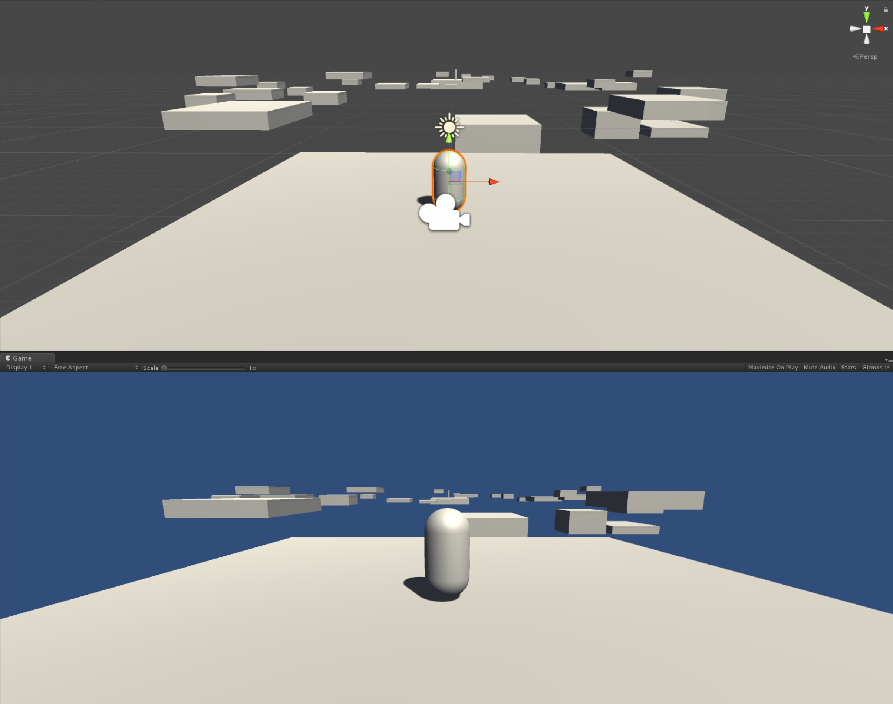

#### 5. Steady cam
In the Scripts folder, create a new C# script called `CameraController` that allows the camera to follow the player. The script should also allow the player to rotate the camera on their own by moving the mouse, either by just moving the mouse or holding down right-click and dragging the mouse to move the camera.

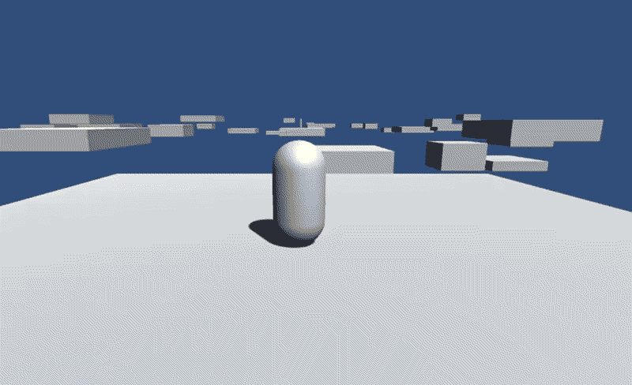

#### 6. Falling up
Currently if the player falls off a platform, it falls infinitely. Edit the `PlayerController` and `CameraController` scripts so that if the player falls from a platform and can’t get to another platform, the player instead falls from the top of the screen onto the start position, causing the player to need to start from the beginning again.

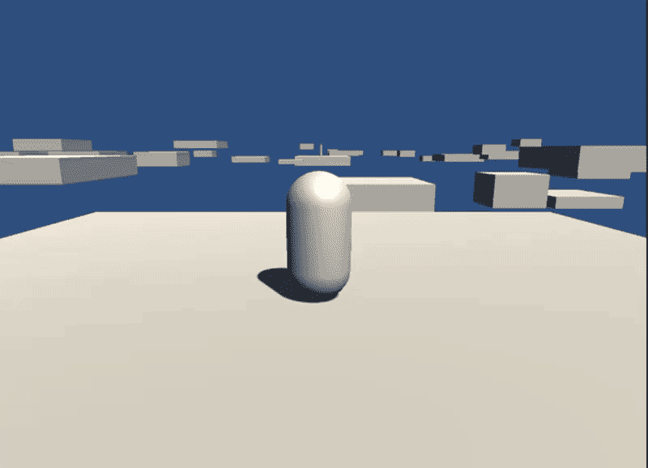

Test your game and check your platform layout, making sure it’s possible to reach the end and that the player’s jump and movement works correctly. You may need to adjust your player’s jump or your platforms’ positioning / size.

#### 7. Time trial
Create a new Canvas and UI Text element that displays a timer on screen.
- Canvas Name: `TimerCanvas`
    - Pixel Perfect: No
    - UI Scale Mode: `Scale With Screen Size`
    - Reference Resolution: `X: 1280` `Y: 800`
    - Screen Match Mode: `Match Width or Height`
    - Match: `1` (Height)
- Text GameObject Name: `TimerText`
- Width: `160`
- Height: `30`
- Anchor: `Top`, `Center`
- Position: `X: 0`, `Y: -40`, `Z: 0`
- Text: `0:00.00`
- Font size: `48`
- Font color: `White`
- Alignment: `Center`, `Middle`
- Horizontal Overflow: `Overflow`
- Vertical Overflow: `Overflow`

Save `TimerCanvas` as a Prefab. Make sure that when you make changes to the `TimerCanvas` Prefab, you Apply the changes at the top of the Inspector window.

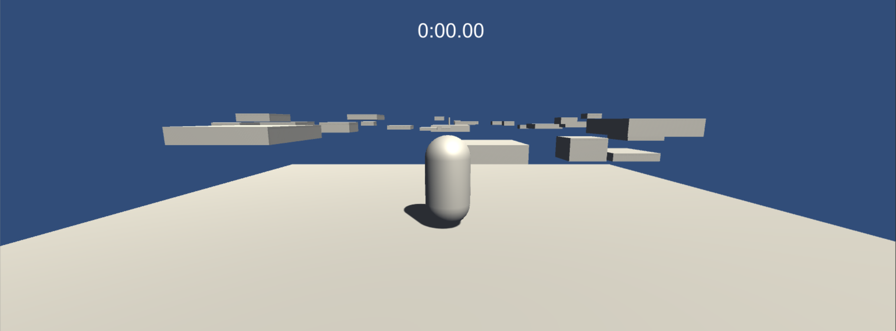

##### 8. Clock's ticking
Create a script called `Timer` and attach to the `Player`. `Timer` should have a public Text variable called `Timer Text` for the TimerText Text object.

The timer should start at `0:00.00` and count up.

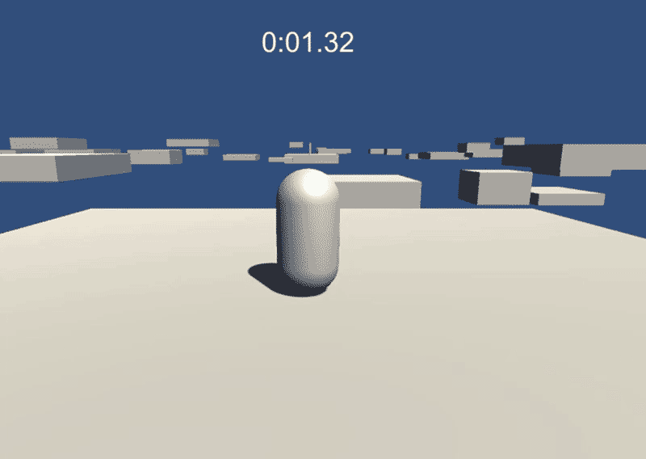

Currently, the timer starts as soon as the scene loads. Instead, we want the timer to start as soon as the Player starts moving. Disable the `Timer` script attached to `Player`. Leave the `TimerCanvas` active so that `0:00.00` is displayed.

Create a Cube GameObject called `TimerTrigger`.

Position: `x: 0`, `y: 1.25`, `z: 0`
Scale: `x: 0`, `y: 2`, `z: 0`
Disable the Mesh Renderer
Create a new script called `TimerTrigger` and attach it to the `TimerTrigger` GameObject. This script should enable the `Timer` script and start counting up as soon as the Player exits the `TimerTrigger`‘s Collider.

If the Player falls and restarts, the timer should **not** reset – it should continue to run.

#### 9. Finish line
Create a script called `WinTrigger` and attach to `WinFlag`.

When the `Player` touches the `WinFlag` collider, the timer should stop and the text size should increase and the color should change to `green`. The recommended increased font size is `60` but the value is at your discretion as long as the size increase is noticeable to the user.

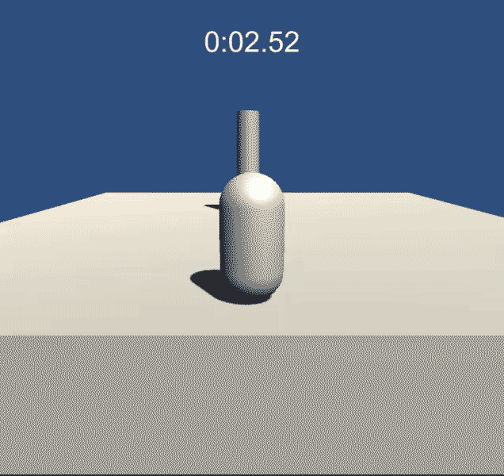

#### 10. The sky's the limit
In the Unity Asset Store, find `Farland Skies - Cloudy Crown`, a free set of `skyboxes`. Add them to a folder called Skyboxes in the `Assets/Materials` folder in your `0x05-unity-assets project`.

Create a skybox with the `CloudyCrown_Midday` material.

In your README, include the following credit: `Skyboxes: Farland Skies - Cloudy Crown` with a link to the page on the Asset Store.

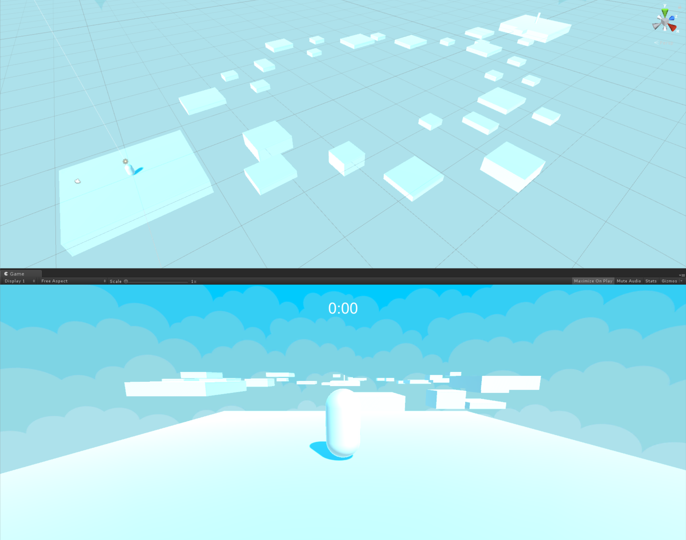

#### 11. The great outdoors
Download [Kenney’s Nature Pack Extended](https://kenney.nl/assets/nature-pack-extended). Import the asset package and place the files in a directory called `Models`. For the sake of organization, inside the `Assets` folder, create a new directory called `Materials` and move the materials in `Models` into `Materials`.

Replace your cube placeholders with the 3D models. The 3D models need [mesh colliders](https://docs.unity3d.com/Manual/class-MeshCollider.html) otherwise the player cannot jump on them. Make sure the player can jump and move between platforms, that the distance and the player’s jump are reasonable, and that the player can reach the end from the starting point.

In your README, include the following credit: `Models: Kenney's Nature Pack Extended` with a link to the website.

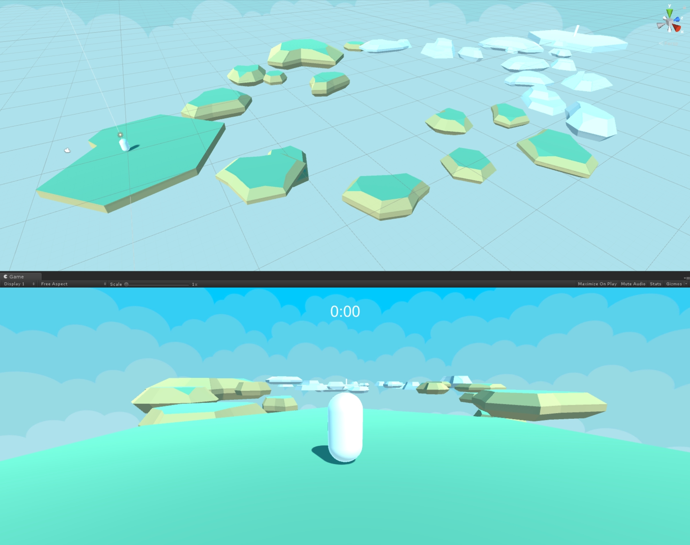

#### 12. Environmental awareness
From the Nature Pack asset package in your `Models` folder, add trees, rocks, flowers, etc. to the platforms as you like. Organize your objects in your Hierarchy using empty GameObjects.

Keep in mind the placement of the objects so as not to block or hinder the player from being able to jump between platforms (unless that’s part of your design!). The player should also not be able to walk through rocks, trees, etc., but may walk through flowers, grass, etc.

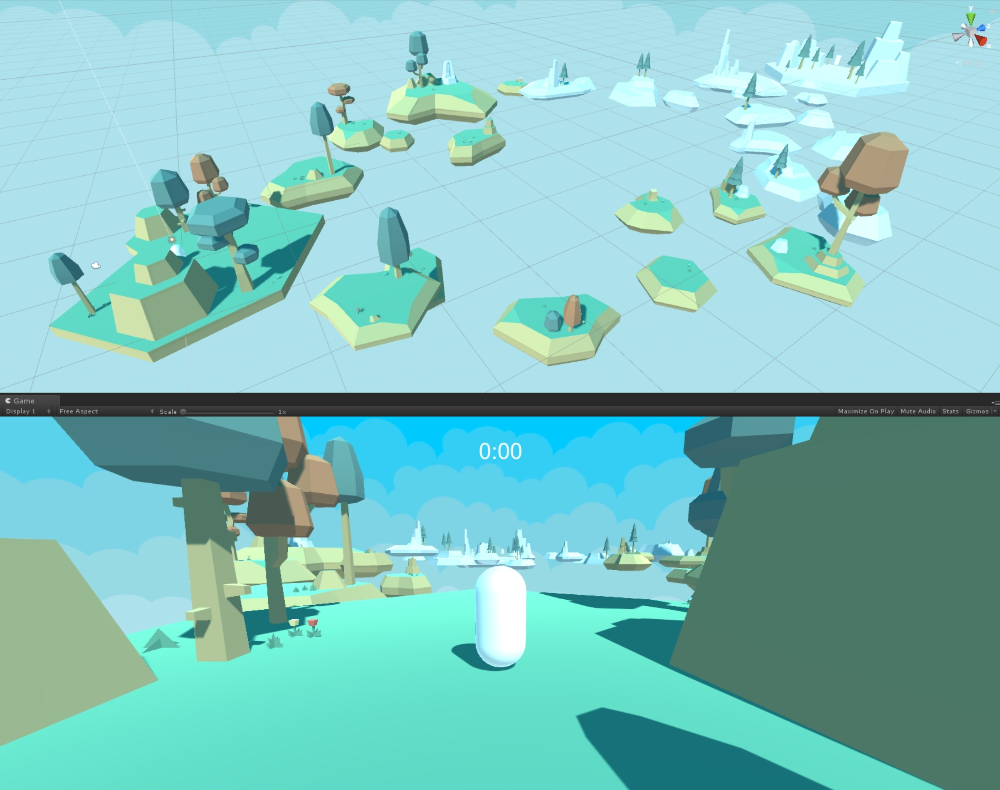

#### 13. What's left of the flag
Download this [flag model](https://intranet-projects-files.s3.amazonaws.com/holbertonschool-cs-unity/435/Flag.fbx). Place it in the `Models` directory. Add `Flag` to your scene and make it a child of the `WinFlag` GameObject. The pole of the flag should be positioned inside `WinFlag`‘s collider. Resize or reposition the collider if necessary.

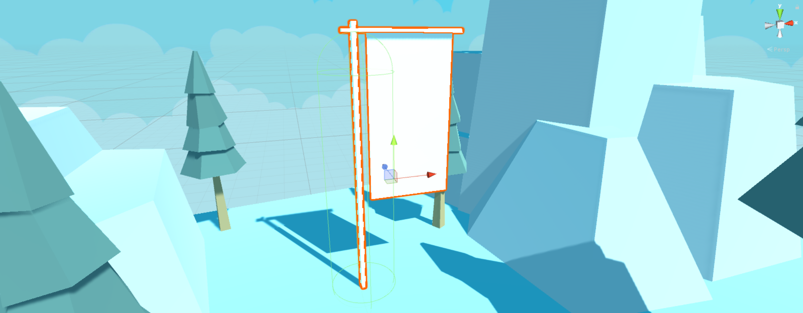

#### 14. (Sea)horse race
Download this [flag texture](https://intranet-projects-files.s3.amazonaws.com/holbertonschool-cs-unity/435/Flag.png). Place it in a new directory called `Textures`.

Import Settings:
- Texture Type: `Default`
- Texture Shape: `2D`
- Wrap Mode: `Repeat`
Inside the `Materials` folder, create a new Material called `Flag` and apply it to the rectangular flag portion of the Flag model. Apply the existing `Wood` Material to the flagpost portion of the model.

#### 15. Under development
**Scenes in Build:**
1. Level01
Create three builds of `Level01` in a directory called `Builds`.
- Windows and Linux builds should be set to `x86_64` architecture
**Build Folder Hierarchy:**
- Builds
    - Linux
        - Platformer_Data
        - Platformer.x86_64
    - Mac
        - Platformer.app
    - Windows
        - Platformer_Data
        - Platformer.exe
        - UnityPlayer.dll
Make sure to run your build and make sure it works! Test your build on all three platforms if possible, but at the very least test on your own computer.

Create a `.zip` of each build:
- `Platformer_Mac.zip`
- `Platformer_Linux_x86_64.zip`
- `Platformer_Windows_x86_64.zip`
Upload the three `.zip` files to Google Drive or Dropbox. Add the links to the files below.
