# 0x06. Unity - Assets: UI

What you'll find? This part of my Learning process is about:
- What is an Asset and how to import and use them
- How to import images to use in a user interface
- What is a Sprite
- How is a Sprite different from a Texture
- How to use the Sprite Editor
- What is 9-slicing
- How to create a Slider
- How to create a Toggle
- How to swap button images
- How to use PlayerPrefs and what are they used for

Here are the task I solve to answer those question and more. The solution to every task is on the file with the same name than the task.

My challenge for you is to try to solve all of this task and after see the way I did it.

This is a project made on Unity 2019.3.0f6. If you have a different version of Unity, you can try to open the project and see if it works. If it doesn't, you can try to update your version of Unity.

This project have deploy to windows, linux and mac platform.

The link to my final result you can find it [Here](https://drive.google.com/drive/folders/1NQwDpBSLhB2QH2OFjM8oxHfx37fL1DkL?usp=share_link)

All the intellectual property of this project is from Holberton School.

#### 0. Leveling up
We’ll be adding on to the last project to add a menu and UI (see [example](https://holbertonschool.github.io/AR-VR/0x06-unity-assets_ui/) ). Duplicate your `0x05-unity-assets_models_textures` directory and rename it `0x06-unity-assets_ui`.

Create two more Scenes in `0x06-unity-assets_ui`. For each new scene, create a new path of platforms for the `Player` to navigate through.

- Scene Name: `Level02`:
    - Skybox: `CloudyCrown_Daybreak`

- Scene Name: Level03:
    - Skybox: CloudyCrown_Midnight

#### 1. Choose your own adventure
The next few tasks will be creating UI elements using imported images to build a menu that allows the player to choose a level.

Download the [Google font "Changa"](https://fonts.google.com/specimen/Changa) and place in a `Changa` folder into a new folder called `Fonts` in the `Assets` folder (the final path should be `Assets/Fonts/Changa/<.ttf files>`). All text should use this font, so change `TimerText`‘s font as well.

Download [these images](https://s3.eu-west-3.amazonaws.com/hbtn.intranet.project.files/holbertonschool-cs-unity/0x06-UI.zip) into a folder called `UI` in the `Textures` folder. Set their `Texture Type` to `Sprite (2D and UI)`.

Create a new Scene called `MainMenu`.

Using this image as a guide, create a new Canvas with the following attributes and child objects:

- Canvas Name: `MenuCanvas`
    - Render mode: `Screen Space - Overlay`
    - Pixel Perfect: No
    - UI Scale Mode: `Scale With Screen Size`
    - Reference Resolution: `X: 1280` `Y: 800`
    - Screen Match Mode: `Match Width or Height`
    - Match: `1` (Height)
    - Reference Pixels Per Unit: `100`
- Image GameObject Name: `MenuBG`
    - `Image`: `bg-menu.png`
    - `Left`: `50`
    - `Top`: `50`
    - `Right`: `50`
    - `Bottom`: `50`
- Image GameObject Name: `Title`
    - Source image: `bg-header.png`
    - Child Text GameObject Name: `TitleText`
        - Text: `LEVEL SELECT`
        - Font: `Changa-ExtraBold.ttf`
        - Font color: `#ffffff`
        - Font size: `60`
        - Alignment: `Center + Middle`
        - Horizontal Overflow: `Overflow`
        - Vertical Overflow: `Overflow`

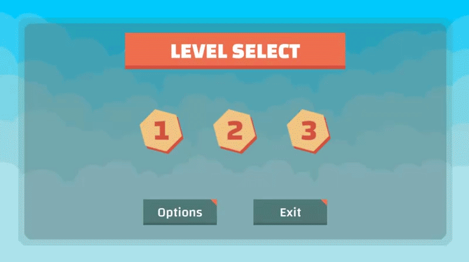

- Level Buttons - You will need to use the Sprite Editor to slice these images. When the mouse is over the button, the button should highlight; when mouse clicks, the button should appear pressed.
    - Button GameObject Name: `Level01`
        - Background image: `button-level01.png`
    - Button GameObject Name: `Level02`
        - Background image: `button-level02.png`
    - Button GameObject Name: `Level03`
        - Background image: `button-level03.png`

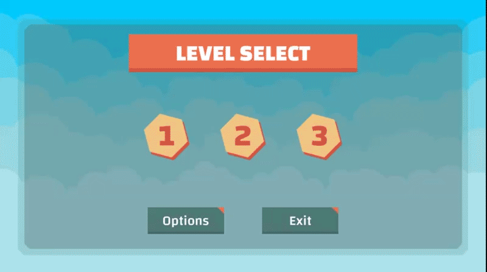

- Other Buttons - You will need to use the Sprite Editor to slice these images. When mouse is over the button, the button should highlight; when mouse clicks, the button should appear pressed.
    - Button GameObject Name: `OptionsButton`
        - Background image: `bg-button.png`
        - Text GameObject: `OptionsText`
        - Text: `Options`
        - Font: `Changa-Medium.ttf`
        - Font color: `#ffffff`
        - Font size: `36`
        - Alignment: Center + Middle
        - Horizontal Overflow: `Overflow`
        - Vertical Overflow: `Overflow`
        - Save this button into a folder called `Prefabs` in the `Assets` folder
    - Button GameObject Name: `ExitButton`
        - Background image: `bg-button.png`
        - Text GameObject: `ExitText`
        - Text: `Exit`
        - Font: `Changa-Medium.ttf`
        - Font color: `#ffffff`
        - Font size: `36`
        - Alignment: Center + Middle
        - Horizontal Overflow: `Overflow`
        - Vertical Overflow: `Overflow`
        - Save this button into a folder called `Prefabs` in the `Assets` folder

#### 2. Option in
Create a new Scene called `Options`.

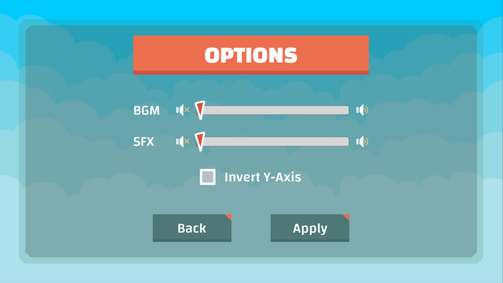

Using this image as a guide, create a new Canvas with the following objects:

- Canvas Name: `OptionsCanvas`
    - Render mode: `Screen Space - Overlay`
    - Pixel Perfect: No
    - UI Scale Mode: `Scale With Screen Size`
    - Reference Resolution: `X: 1280` `Y: 800`
    - Screen Match Mode: `Match Width or Height`
    - Match: `1` (Height)
- Image GameObject Name: `MenuBG`
    - Image: `bg-menu.png`
    - Left: `50`
    - Top: `50`
    - Right: `50`
    - Bottom: `50`
- Image GameObject Name: `Title`
    - Source image: `bg-header.png`
    - Child Text GameObject Name: `TitleText`
        - Text: `OPTIONS`
        - Font: `Changa-ExtraBold.ttf`
        - Font color: `#ffffff`
        - Font size: `60`
        - Alignment: Center + Middle
        - Horizontal Overflow: `Overflow`
        - Vertical Overflow: `Overflow`

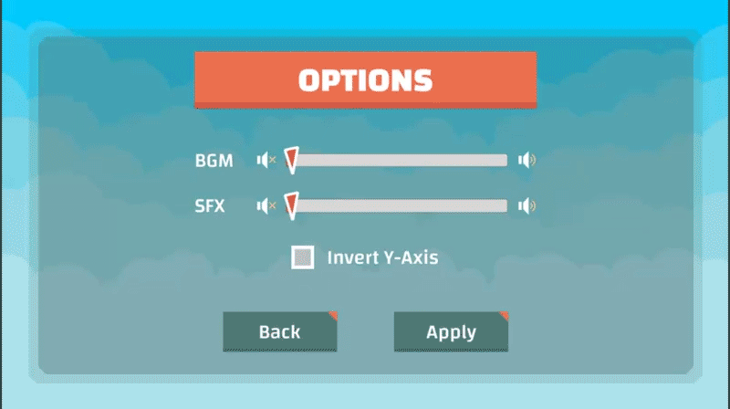

- Slider GameObject Name: `BGMSlider`
    - Child Text GameObject Name: `BGMText`
    - Text: `BGM`
    - Font: `Changa-Medium.ttf`
    - Font color: `#ffffff`
    - Font size: `36`
    - Handle image: `slider-handle.png`
    - Image Name: `Mute`
    - Image Source: `sound-mute.png`
    - Image Name: `Full`
    - Image Source: `sound-full.png`
- Slider GameObject Name: `SFXSlider`
    - Child Text GameObject Name: `SFXText`
    - Text: `SFX`
    - Font: `Changa-Medium.ttf`
    - Font color: `#ffffff`
    - Font size: `36`
    - Handle image: `slider-handle.png`
    - Image Name: `Mute`
    - Image Source: `sound-mute.png`
    - Image Name: `Full`
    - Image Source: `sound-full.png`
- Toggle GameObject Name: `InvertYToggle`
    - Child Text GameObject Name: `InvertYToggleText`
    - Text: `Invert Y-Axis`
    - Font: `Changa-Medium.ttf`
    - Font color: `#ffffff`
    - Font size: `36`
    - Background image: `bg-toggle.png`
    - Checkmark: `check-toggle.png`
- Buttons
    - Button GameObject Name: `BackButton`
        - Background image: `bg-button.png`
        - Child Text GameObject Name: `BackText`
        - Text: `Back`
        - Font: `Changa-Medium.ttf`
        - Font color: `#ffffff`
        - Font size: `36`
        - Save this button into a folder called `Prefabs` in the `Assets` folder
    - Button GameObject Name: `ApplyButton`
        - Background image: `bg-button.png`
        - Child Text GameObject Name: `ApplyText`
        - Text: `Apply`
        - Font: `Changa-Medium.ttf`
        - Font color: `#ffffff`
        - Font size: `36`
        - Save this button into a folder called `Prefabs` in the `Assets` folder

#### 3. Pushing buttons
Create a new C# script called `MainMenu.cs`. In the `MainMenu` scene, script the level buttons scene so that choosing `Level01`, `Level02`, or `Level03` loads the corresponding scene.

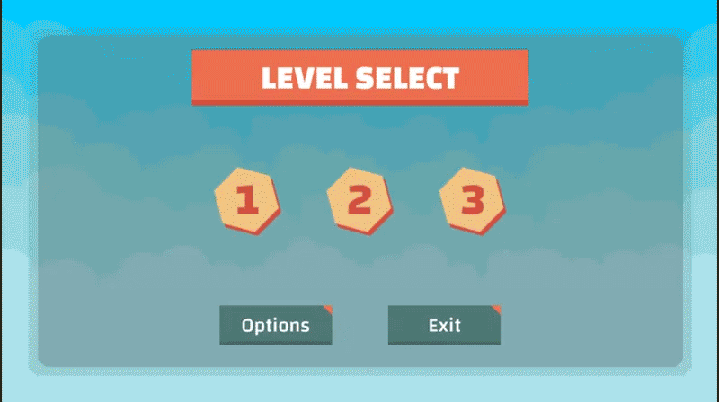

- Class Name: public class MainMenu : MonoBehaviour
- Prototype: public void LevelSelect(int level)

Then script `OptionsButton` so that clicking on it loads the `Options` scene and script the `ExitButton` so that when it is clicked, the game is closed and `Exited` is printed to the console.

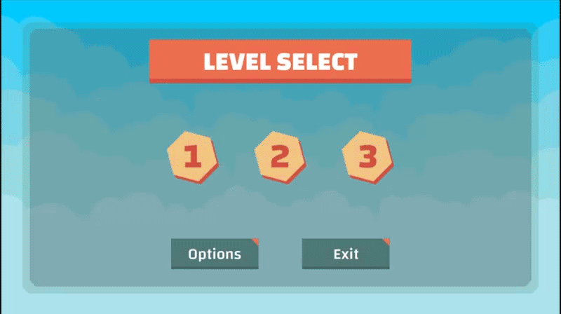

- Class Name: `public class MainMenu : MonoBehaviour`
- Prototype: `public void Options()`

Create a new C# script called `OptionsMenu.cs` In the `Options` scene, script `BackButton` so that it loads the previous scene (which will not necessarily always be the `MainMenu` scene, as later we’ll implement the ability to access the Options menu during gameplay).
- Class Name: `public class OptionsMenu : MonoBehaviour`
- Prototype: `public void Back()`

#### 4. Wait, hold on, time out
Inside the `Level01` Scene, create a new Canvas and using the image as a guide, create a pause screen with the following objects:

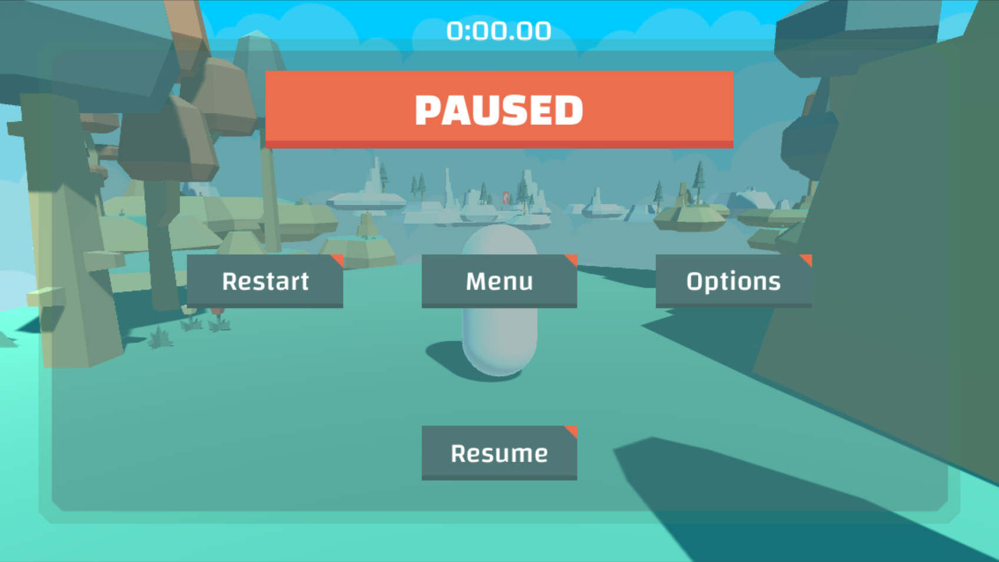

- Canvas Name: `PauseCanvas`
    - Render mode: `Screen Space - Overlay`
    - Pixel Perfect: No
    - UI Scale Mode: `Scale With Screen Size`
    - Reference Resolution: `X: 1280` `Y: 800`
    - Screen Match Mode: `Match Width or Height`
    - Match: `1` (Height)
- Image GameObject Name: `MenuBG`
    - Image: `bg-menu.png`
    - `Left`: `50`
    - `Top`: `50`
    - `Right`: `50`
    - `Bottom`: `50`
- Image GameObject Name `Title`
    - Background image: `bg-header.png`
    - Child Text GameObject Name: `TitleText`
        - Text: `PAUSED`
        - Font: `Changa-ExtraBold.ttf`
        - Font color: `#ffffff`
        - Font size: `60`
        - Alignment: Center + Middle
        - Horizontal Overflow: `Overflow`
        - Vertical Overflow: `Overflow`
- Buttons
    - Button GameObject Name: `RestartButton`
        - Child Text GameObject Name: `RestartText`
        - Text: `Restart`
        - Font: `Changa-Medium.ttf`
        - Font color: `#ffffff`
        - Font size: `36`
        - Background image: `bg-button.png`
    - Button GameObject Name: `MenuButton`
        - Child Text GameObject Name: `MenuText`
        - Text: `Menu`
        - Font: `Changa-Medium.ttf`
        - Font color: `#ffffff`
        - Font size: `36`
        - Background image: `bg-button.png`
    - `OptionsButton` prefab
    - Button GameObject Name: `ResumeButton`
        - Child Text GameObject Name: `ResumeText`
        - Text: `Resume`
        - Font: `Changa-Medium.ttf`
        - Font color: `#ffffff`
        - Font size: `36`
        - Background image: `bg-button.png`

Set the `PauseCanvas` as inactive by un-checking the box at the top of the Inspector and save it as a Prefab.

#### 5. Es-ca-pé
Create a new C# script called `PauseMenu.cs`. Add a method to this script so that when the player presses Esc while playing the game, the game should pause and the `PauseCanvas` should become active. The timer should also pause.
- Class: `public class PauseMenu : MonoBehaviour`
- Prototype: `public void Pause()`

Add another method so that If the player presses Esc while in the `PauseMenu` or presses the `Resume` button, the game should unpause where the player left off and the timer should continue from where it stopped.
- Class: `public class PauseMenu : MonoBehaviour`
- Prototype: `public void Resume()`

Make sure to save the changes to the `PauseMenu` Prefab by pressing the Apply button at the top of the Inspector.

#### 6. Even more button pushing
In the `PauseMenu` and `PauseMenu.cs`, script the `RestartButton` so that it reloads the level scene that the player is currently on.

- Class: `public class PauseMenu : MonoBehaviour`
- Prototype: `public void Restart()`
Script the `MenuButton` so that it loads the `MainMenu` scene.

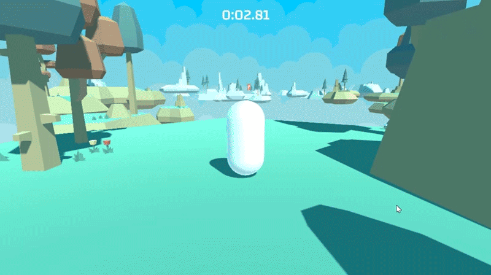

- Class:` public class PauseMenu : MonoBehaviour`
- Prototype: `public void MainMenu()`
Script the `OptionsButton` so that it loads the `Options` scene.

- Class: `public class PauseMenu : MonoBehaviour`
- Prototype: `public void Options()`
Apply the changes to the `PauseMenu` Prefab then add it to the `Level02` and `Level03` scenes.

#### 7. Up is down, down is up
In the `CameraController.cs` script, add the ability to [invert the Y axis](https://www.giantbomb.com/inverted-controls/3015-5663/).

Create a public bool called `isInverted`.

The camera should be able to work in two ways:

- Normal: The camera should move up when the mouse moves up and down when the mouse moves down.
- Inverted: The camera should move up when the mouse moves down and down when the mouse moves up.

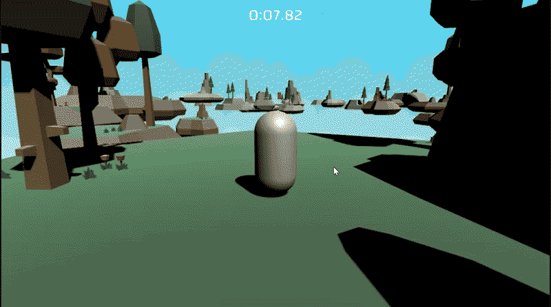

Test it by checking `isInverted` on and off in the Inspector as you play the game.

#### 8. But Y?
In `Options` and `OptionsMenu.cs`, script it so that checking the `InvertYToggle` in the menu and applying the changes reverses the camera/mouse movements in the level scene.

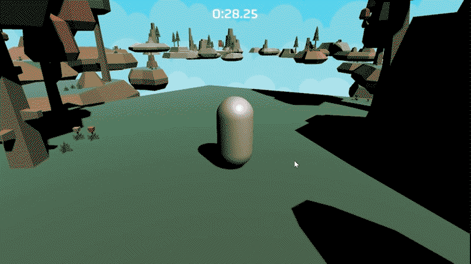

Clicking `Apply` should save any changes and return to the scene the player was previously on, whether it was the `MainMenu` or a level.
- Class Name: `public class OptionsMenu : MonoBehaviour`
- Prototype: `public void Apply()`
Clicking `Back` should not save any changes return to the scene the player was previously on, whether it was the `MainMenu` or a level.
- Class Name: `public class OptionsMenu : MonoBehaviour`
- Prototype: `public void Back()`
The state of `Invert Y-Axis` should be persistent even if the player chooses a new level or navigates through different menus.

#### 9. A winner is you
In the `Level01` Scene, create a new Canvas and using the image as a guide, create a win screen with the following objects:

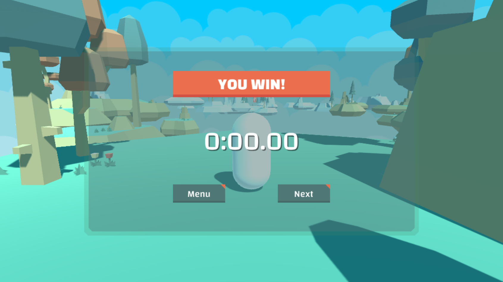

- Canvas Name: `WinCanvas`
    - Render mode: `Screen Space - Overlay`
    - Pixel Perfect: No
    - UI Scale Mode: `Scale With Screen Size`
    - Reference Resolution: `X: 1280` `Y: 800`
    - Screen Match Mode: `Match Width or Height`
    - Match: `1` (Height)
- Image GameObject Name: `MenuBG`
    - Image: `bg-menu.png`
    - `Left`: `50`
    - `Top`: `50`
    - `Right`: `50`
    - `Bottom`: `50`
- Image GameObject Name: `Title`
    - Background image: `bg-header.png`
    - Child Text GameObject Name: `TitleText`
        - Text: `YOU WIN!`
        - Font: `Changa-ExtraBold.ttf`
        - Font color: `#ffffff`
        - Font size: `60`
        - Alignment: Center + Middle
        - Horizontal Overflow: `Overflow`
        - Vertical Overflow: `Overflow`
- Buttons
    - Button GameObject Name: `MenuButton` - Child Text GameObject Name: `MenuText`
        - Text: `Menu`
        - Font: `Changa-Medium.ttf`
        - Font color: `#ffffff`
        - Font size: `36`
        - Background image: `bg-button.png`
    - Button GameObject Name: `NextButton` - Child Text GameObject Name: `NextText`
        - Text: `Next`
        - Font: `Changa-Medium.ttf`
        - Font color: `#ffffff`
        - Font size: `36`
        - Background image: `bg-button.png`
- Text GameObject Name: `FinalTime`
    - Text: `0:00.00`
    - Font: `Changa-Medium.ttf`
    - Font color: `#ffffff`
    - Font size: `100`
    - Add a `Shadow` Component
    - Effect Color: `#000000`
    - Effect Distance: `X: 4`, `Y: -4`
Set the `WinCanvas` as inactive by un-checking the box at the top of the Inspector and save it as a Prefab.

#### 10. Winning isn't everything
Edit `WinTrigger`.cs so that when the player touches the flag, `WinCanvas` becomes active.

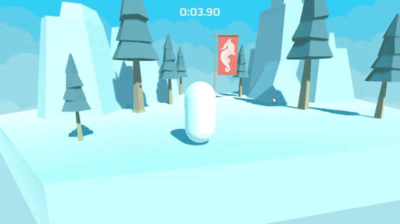

Add a method to `Timer.cs` so that when the player touches the flag, the player’s finish time is displayed in `FinalTime` in `WinCanvas`.
- Class Name: `public class Timer : MonoBehaviour`
- Prototype: `public void Win()`
Create a new C# script called `WinMenu.cs`.

Script the `MenuButton` so that it takes the player to the `MainMenu` Scene.
- Class Name: `public class WinMenu : MonoBehaviour`
- Prototype: `public void MainMenu()`
Script the `NextButton` so that it loads the next level. If they are currently on the last level, load the `MainMenu` instead.
- Class Name: `public class WinMenu : MonoBehaviour`
- Prototype: `public void Next()`

#### 11. Still under development
**Scenes in Build:**
1. `MainMenu`
2. `Options`
3. `Level01`
4. `Level02`
5. `Level03`
Create three builds of all scenes above in the `Builds` directory.
- Windows and Linux builds should be set to `x86_64` architecture
**Build Folder Hierarchy:**
- Builds
    - Linux
        - Platformer_Data
        - Platformer.x86_64
    - Mac
        - Platformer.app
    - Windows
        - Platformer_Data
        - Platformer.exe
        - UnityPlayer.dll
Make sure to run your build and make sure it works! Test your build on all three platforms if possible, but at the very least test on your own computer.

Create a `.zip` of each build:
- `Platformer_Mac.zip`
- `Platformer_Linux_x86_64.zip`
- `Platformer_Windows_x86_64.zip`
Upload the three `.zip` files to Google Drive or Dropbox. Add the links to the files below.
