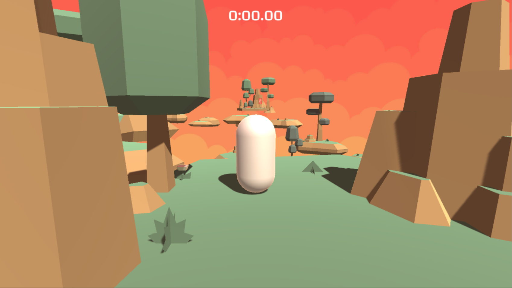
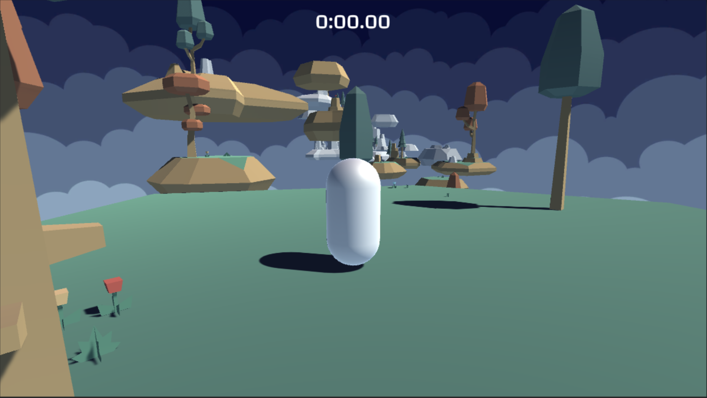
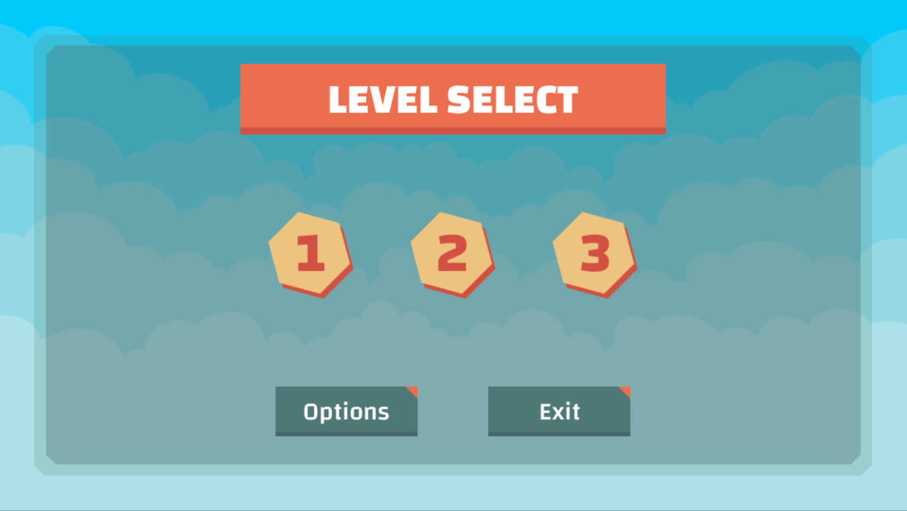

# 0x06. Unity - Assets: UI

What you'll find? This part of my Learning process is about:
- What is an Asset and how to import and use them
- How to import images to use in a user interface
- What is a Sprite
- How is a Sprite different from a Texture
- How to use the Sprite Editor
- What is 9-slicing
- How to create a Slider
- How to create a Toggle
- How to swap button images
- How to use PlayerPrefs and what are they used for

Here are the task I solve to answer those question and more. The solution to every task is on the file with the same name than the task.

My challenge for you is to try to solve all of this task and after see the way I did it.

This is a project made on Unity 2019.3.0f6. If you have a different version of Unity, you can try to open the project and see if it works. If it doesn't, you can try to update your version of Unity.

This project have deploy to windows, linux and mac platform.

The link to my final result you can find it [Here](https://drive.google.com/drive/folders/1NQwDpBSLhB2QH2OFjM8oxHfx37fL1DkL?usp=share_link)

#### 0. Leveling up
We’ll be adding on to the last project to add a menu and UI (see [example](https://holbertonschool.github.io/AR-VR/0x06-unity-assets_ui/) ). Duplicate your `0x05-unity-assets_models_textures` directory and rename it `0x06-unity-assets_ui`.

Create two more Scenes in `0x06-unity-assets_ui`. For each new scene, create a new path of platforms for the `Player` to navigate through.

- Scene Name: `Level02`:
    - Skybox: `CloudyCrown_Daybreak`

- Scene Name: Level03:
    - Skybox: CloudyCrown_Midnight

#### 1. Choose your own adventure
The next few tasks will be creating UI elements using imported images to build a menu that allows the player to choose a level.

Download the [Google font "Changa"](https://fonts.google.com/specimen/Changa) and place in a `Changa` folder into a new folder called `Fonts` in the `Assets` folder (the final path should be `Assets/Fonts/Changa/<.ttf files>`). All text should use this font, so change `TimerText`‘s font as well.

Download [these images](https://s3.eu-west-3.amazonaws.com/hbtn.intranet.project.files/holbertonschool-cs-unity/0x06-UI.zip) into a folder called `UI` in the `Textures` folder. Set their `Texture Type` to `Sprite (2D and UI)`.

Create a new Scene called `MainMenu`.

Using this image as a guide, create a new Canvas with the following attributes and child objects:

- Canvas Name: `MenuCanvas`
    - Render mode: `Screen Space - Overlay`
    - Pixel Perfect: No
    - UI Scale Mode: `Scale With Screen Size`
    - Reference Resolution: `X: 1280` `Y: 800`
    - Screen Match Mode: `Match Width or Height`
    - Match: `1` (Height)
    - Reference Pixels Per Unit: `100`
- Image GameObject Name: `MenuBG`
    - `Image`: `bg-menu.png`
    - `Left`: `50`
    - `Top`: `50`
    - `Right`: `50`
    - `Bottom`: `50`
- Image GameObject Name: `Title`
    - Source image: `bg-header.png`
    - Child Text GameObject Name: `TitleText`
        - Text: `LEVEL SELECT`
        - Font: `Changa-ExtraBold.ttf`
        - Font color: `#ffffff`
        - Font size: `60`
        - Alignment: `Center + Middle`
        - Horizontal Overflow: `Overflow`
        - Vertical Overflow: `Overflow`

