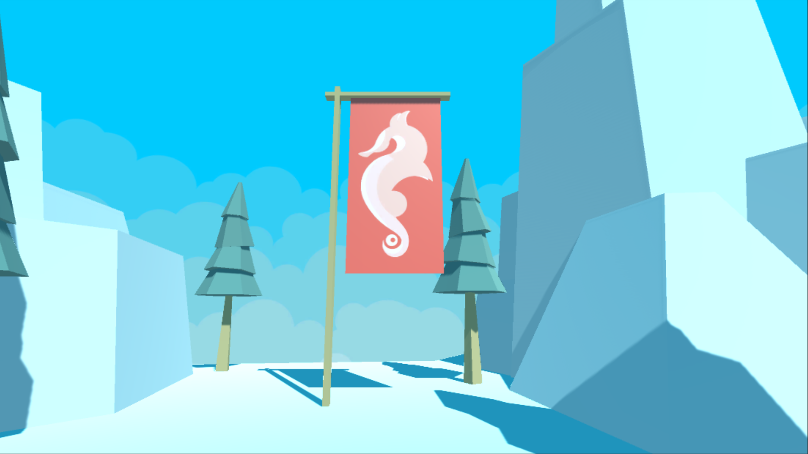

# 0x07. Unity - Animation

What you'll find? This part of my Learning process is about:
- What is a keyframe
- What are Dopesheets and how to use them
- What are Curves and how to use them
- How to import and use Animation Clips
- What are Animator Controllers and how to use them
- What is a State Machine
- What is a Sub-State Machine
- What is Root Motion

Here are the tasks I solve to answer those question and more. The solution to every task is on the file with the same name than the task.

My challenge for you is to try to solve all of this task and after see the way I did it.

This is a project made on Unity 2019.3.0f6. If you have a different version of Unity, you can try to open the project and see if it works. If it doesn't, you can try to update your version of Unity.

This project have deploy to windows, linux and mac platform.

The link to my final result you can find it [Here]()

All the intellectual property of this project is from Holberton School.

This project is extended from [0x06-unity-assets_ui](https://github.com/bcondict/holbertonschool-unity/tree/main/0x06-unity-assets_ui)

## Tasks

#### 0. Cinematic universe
We’re continuing to add on to the Platformer project to add animation (see [example](https://holbertonschool.github.io/AR-VR/0x07-unity-animation/)). Duplicate your `0x06-unity-assets_ui` directory from the previous project and rename it `0x07-unity-animation`.

In `Level01` scene, disable `Main Camera` by clicking on the checkbox next to its name in the Inspector. Create a new Camera GameObject named `CutsceneCamera`. The camera should be facing the end flag.

Open the Animation tab (`CTRL + 6`), and with `CutsceneCamera` selected, click on the `Create` button inside the Animation tab. Save the new Animation with the name `Intro01`. Create two new folders `Animations` and `Animators`. Put `Intro01` into the `Animations` folder and `CutsceneCamera` into the `Animators` folder.
