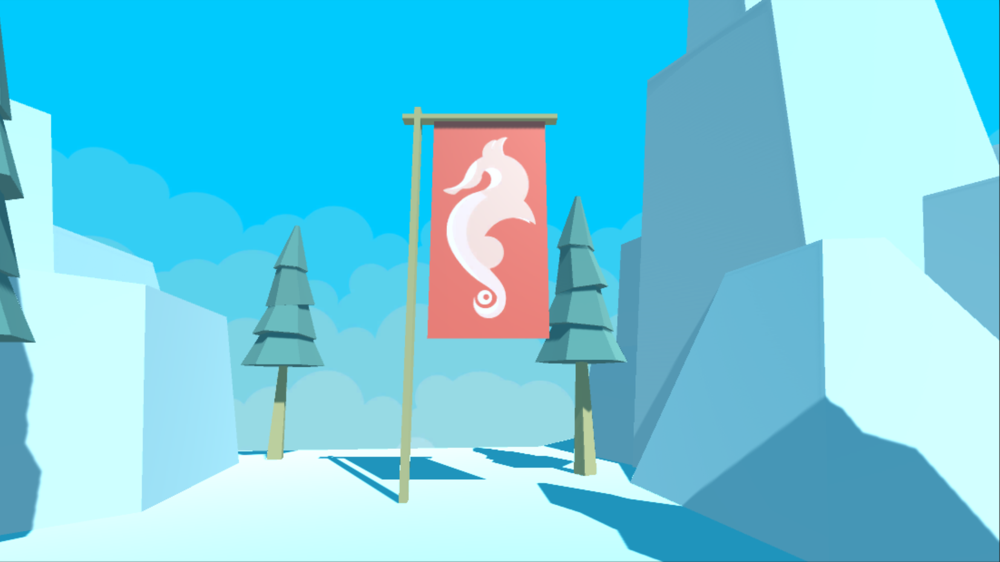
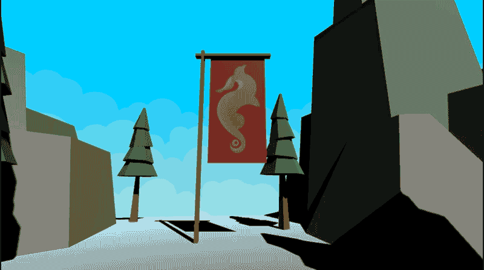
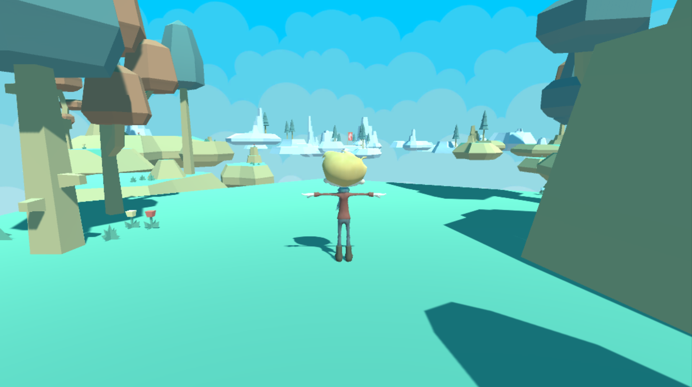
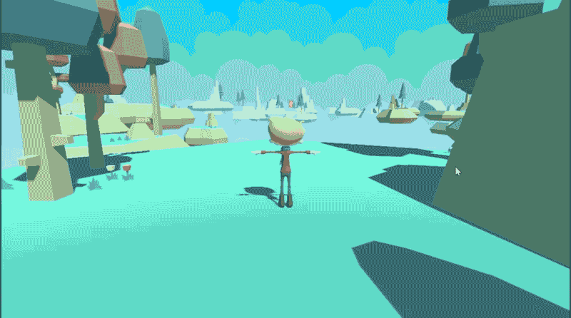
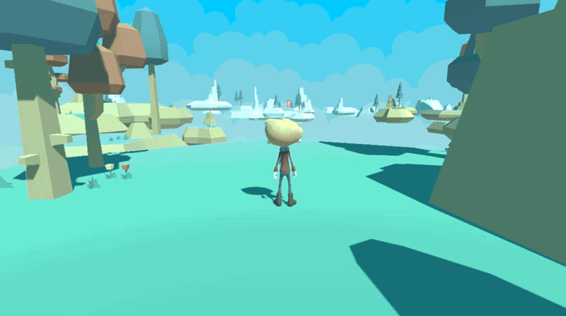
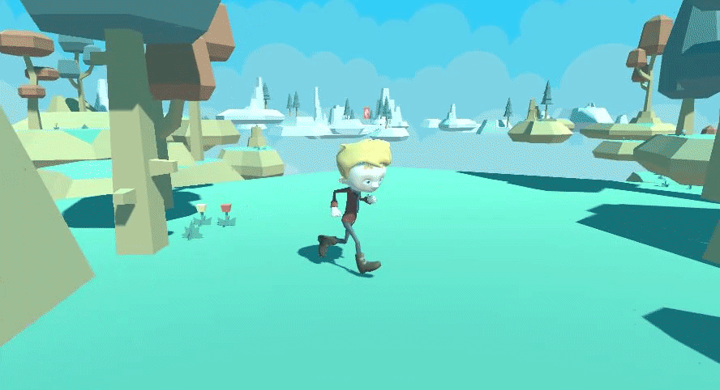
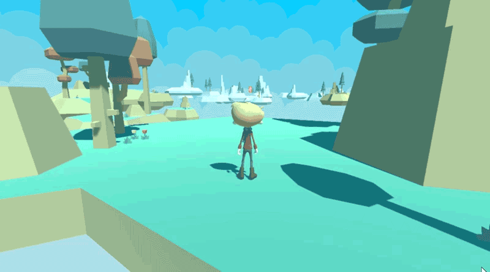
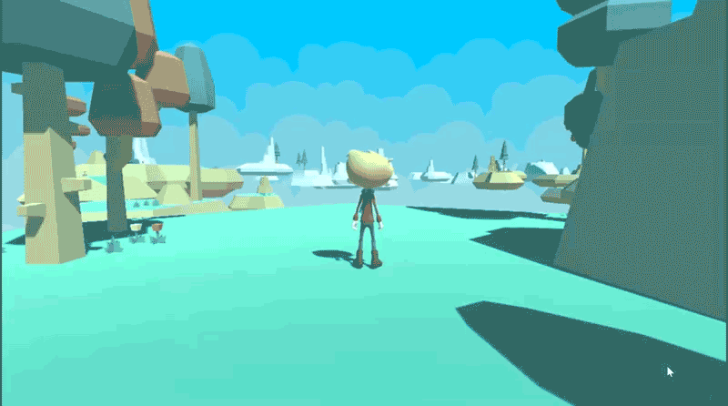
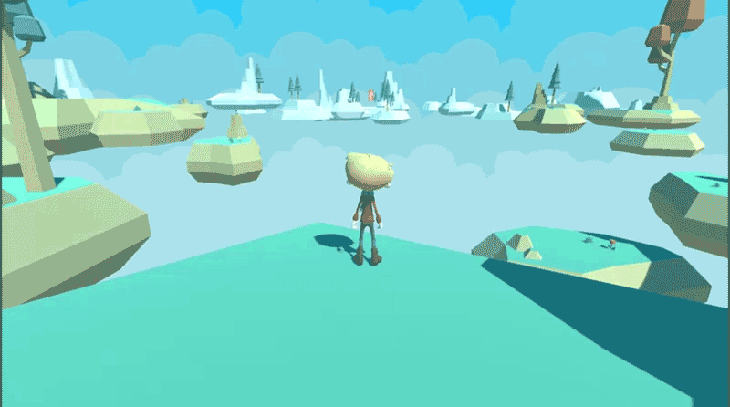

# 0x07. Unity - Animation

What you'll find? This part of my Learning process is about:
- What is a keyframe
- What are Dopesheets and how to use them
- What are Curves and how to use them
- How to import and use Animation Clips
- What are Animator Controllers and how to use them
- What is a State Machine
- What is a Sub-State Machine
- What is Root Motion

Here are the tasks I solve to answer those question and more. The solution to every task is on the file with the same name than the task.

My challenge for you is to try to solve all of this task and after see the way I did it.

This is a project made on Unity 2019.3.0f6. If you have a different version of Unity, you can try to open the project and see if it works. If it doesn't, you can try to update your version of Unity.

This project have deploy to windows, linux and mac platform.

The link to my final result you can find it [Here]()

All the intellectual property of this project is from Holberton School.

This project is extended from [0x06-unity-assets_ui](https://github.com/bcondict/holbertonschool-unity/tree/main/0x06-unity-assets_ui)

## Tasks

#### 0. Cinematic universe
We’re continuing to add on to the Platformer project to add animation (see [example](https://holbertonschool.github.io/AR-VR/0x07-unity-animation/)). Duplicate your `0x06-unity-assets_ui` directory from the previous project and rename it `0x07-unity-animation`.

In `Level01` scene, disable `Main Camera` by clicking on the checkbox next to its name in the Inspector. Create a new Camera GameObject named `CutsceneCamera`. The camera should be facing the end flag.

Open the Animation tab (`CTRL + 6`), and with `CutsceneCamera` selected, click on the `Create` button inside the Animation tab. Save the new Animation with the name `Intro01`. Create two new folders `Animations` and `Animators`. Put `Intro01` into the `Animations` folder and `CutsceneCamera` into the `Animators` folder.

#### 1. Keyframes
With `Intro01` open in the Animation tab, use keyframes to animate the `CutsceneCamera`‘s Position and Rotation so that the camera pulls back from the flag, panning over the length of the platforms, and stopping behind the player, ending in the position and rotation of the `Main Camera`.

- `CutsceneCamera` End Position: `x: 0`, `y: 2.5`, `z: -6.25`
- `CutsceneCamera` End Rotation: `x: 9`, `y: 0`, `z: 0`
The camera’s position and rotation can be of any value during the animation, but it must start at the given value in task #0 and stop at the given values in this task so that the transition of the view from CutsceneCamera to Main Camera in the next task will be seamless. The animation should not loop.

#### 2. Transitions
Open the `CutsceneCamera` Animator in the Animator tab. Make sure that `Entry` has a transition to `Intro`.

Disable `PlayerController` script in the `Player` GameObject and disable the `TimerCanvas`. Create a script called `CutsceneController.cs` and attach it to the `CutsceneCamera` GameObject. This script should do the following when the `Level01` animation is finished playing:

- Enable Main Camera
- Enable PlayerController
- Enable TimerCanvas
- Disable CutsceneController
When you press Play on the `Level01` scene, the `Intro01` animation should play. The Player should not be able to move during the animation. When the camera stops behind the Player, the Timer should become visible but not start. When the Player moves, the Timer should start and the Main Camera should follow the Player. From this point, gameplay should continue as developed in the previous projects.

#### 3. Sorry Sylvain, it's not a Tic Tac anymore
Download [this character model](https://s3.eu-west-3.amazonaws.com/hbtn.intranet.project.files/holbertonschool-cs-unity/animations/ty.fbx) and import it into your `Models` folder. You may need to remap the materials and textures associated with the model. If you cannot find the materials and/or textures, extract them from the model’s `Materials` tab in the Inspector.

In the Hierarchy window, disable `Player`‘s Mesh Renderer and make the model `ty.fbx` a child of the `Player` GameObject. Press Play to test it. The model should be in T-pose and move exactly the same as the Capsule placeholder object did, while in T-pose.

Make sure the `ty.fbx` model has these properties in the Inspector:

- Rig
    - Animation Type: Humanoid
    - Avatar Definition: Create From This Model

#### 4. Running in circles
Edit `CameraController.cs`, and `PlayerController.cs` so that the camera still follows the player, but when the player turns, it does not change the orientation of the camera. The only rotation the camera should do is when the player moves the camera with the mouse.

#### 5. Happily idling
All of the animations we’ll be using in this project are from [Mixamo](https://www.mixamo.com/).

Download [this Animation Clip](https://s3.eu-west-3.amazonaws.com/hbtn.intranet.project.files/holbertonschool-cs-unity/animations/ty@Happy%20Idle.fbx) and import it into your `Animations` folder. Assign the following settings in the Inspector:

- Rig
    - Animation Type: Humanoid
    - Avatar Definition: Create From This Model
In the `Animators` folder, create a new Animator named `ty.controller`. Drag the `Happy Idle` animation into the Animator tab and create a transition from the `Entry` state to the `Happy Idle` state.

The `Happy Idle` animation should loop continuously while the player isn’t moving. Attach the Animator to the ty model inside the `Player` prefab.

#### 6. Run boy run
Download [this Animation Clip](https://s3.eu-west-3.amazonaws.com/hbtn.intranet.project.files/holbertonschool-cs-unity/animations/ty@Running.fbx) and import it into your `Animations` folder. Change the settings so that they match `Happy Idle`‘s settings.

Drag the `Running` animation into the `ty` Animator and create transitions to and from the `Happy Idle` state. Name the transitions `IdleToRunning` and `RunningToIdle` accordingly.

The `Running` animation should start immediately (i.e. the `Running` animation shouldn’t wait until the `Happy Idle` animation is finished to start). When the player stops running, the `Running` animation should stop and the `Happy Idle` animation should start again.

#### 7. Jump, jump
Download [this Animation Clip](https://s3.eu-west-3.amazonaws.com/hbtn.intranet.project.files/holbertonschool-cs-unity/animations/ty@Jump.fbx) and import it into your `Animations` folder. Change the settings so it matches `Happy Idle` and `Running`‘s settings.

Drag the `Jump` animation into the `ty` Animator and create transitions to and from the `Happy Idle` state as well as the `Running` state. Name the transitions `IdleToJump`, `JumpToIdle`, `JumpToRunning`, and `RunningToJump` accordingly.

If the player is standing still, the `Jump` animation should start immediately (i.e. the `Jump` animation shouldn’t wait until the `Happy Idle` animation is finished to start). When the player lands, the `Jump` animation should stop and the `Idle` animation should start again. The `Jump` animation should play only once and not loop.

If the player is running, the `Jump` animation should start immediately (i.e. the `Jump` animation shouldn’t wait until the `Running` animation is finished to start). When the player lands, the `Jump` animation should stop and if the player is still moving forward, the `Running` animation should start again. If the player is no longer moving forward, the `Idle` animation should start again.

#### 8. Free falling
Create a new Sub-state Machine called `FallingDown`. Create transitions to it from `Running` and `Jump` named `RunningToFalling` and `JumpToFalling`.

Download [this Animation Clip](https://s3.eu-west-3.amazonaws.com/hbtn.intranet.project.files/holbertonschool-cs-unity/animations/ty@Falling.fbx) and import it into your `Animations` folder.

Add a new State called `Falling` inside the `FallingDown` Sub-state Machine. When the player is falling from a platform, whether they run off or jump off, the `Falling` animation should play until the player lands on the starting position again.

#### 9. Splat
Download [this Animation Clip](https://s3.eu-west-3.amazonaws.com/hbtn.intranet.project.files/holbertonschool-cs-unity/animations/ty@Falling%20Flat%20Impact.fbx) and import it into your `Animations` folder.

Add a new State called `Falling Flat Impact`. Create a transition from `Falling` to `Falling Flat Impact` called FallingToImpact. This animation should play when the player lands on the starting position after falling. This animation should play once and not repeat.

#### 10. Down but not out
Download this [Animation](https://s3.eu-west-3.amazonaws.com/hbtn.intranet.project.files/holbertonschool-cs-unity/animations/ty@Getting%20Up.fbx) Clip and import it into your `Animations` folder.

Add a new State called `Getting Up`. Create a transition from `Falling Flat Impact` to `Getting Up` named `ImpactToGettingUp`. Create a transition from the `FallingDown` sub-state to `Idle` named `GettingUpToIdle`. This animation should play after the `Falling Flat Impact` animation finishes. This animation should play once and not repeat.

#### 11. Animated features
Update the `Level02` and `Level03` scenes to have their own intro animations named `Intro02` and `Intro03` respectively. Replace the placeholder player with the animated model in each scene as well.

Some of the animations may not transition well or may clip through the floor or have other visual issues. Change the animations’ settings in the Inspector accordingly to adjust. ([Hint](https://docs.unity3d.com/Manual/RootMotion.html)) You should also edit the transition times or animation length times to create smooth animations and a good player experience.

#### 12. Not quite done yet
**Scenes in Build:**

1. MainMenu
2. Options
3. Level01
4. Level02
5. Level03
Create three builds of all scenes above in the `Builds` directory.
- Windows and Linux builds should be set to `x86_64` architecture

**Build Folder Hierarchy:**

- Builds
    - Linux
        - Platformer_Data
        - Platformer.x86_64
    - Mac
        - latformer.app
    - Windows
        - Platformer_Data
        - Platformer.exe
        - UnityPlayer.dll
Make sure to run your build and make sure it works! Test your build on all three platforms if possible, but at the very least test on your own computer.

Create a `.zip` of each build:

- `Platformer_Mac.zip`
- `Platformer_Linux_x86_64.zip`
- `Platformer_Windows_x86_64.zip`
Upload the three `.zip` files to Google Drive or Dropbox. Add the links to the files below.
