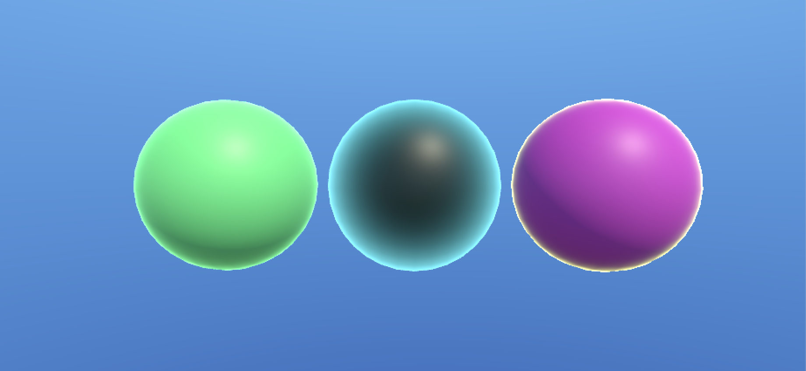
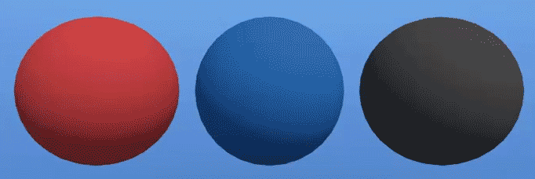
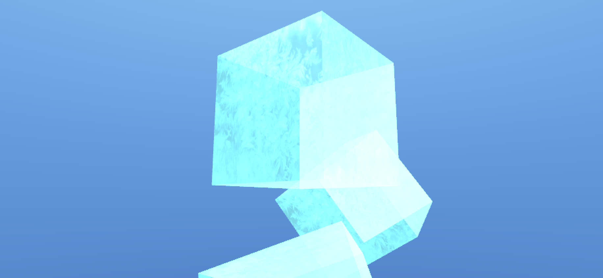
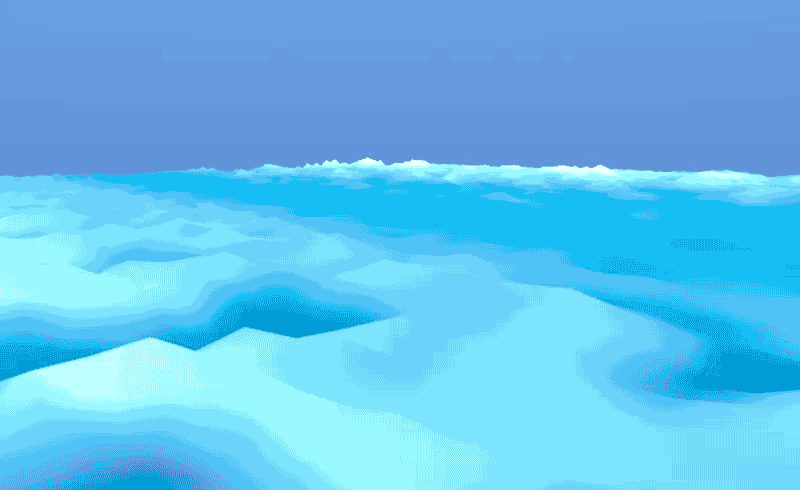

# Unity - ShaderGraph

This projects is about learning how to use ShaderGraph to create shaders in Unity.

The project was made using Unity 2020.3.14f1 and the Universal Render Pipeline (URP) 10.5.0.

To visualize the content clone the repo and open the project in Unity Hub platform.

All the intelectual property belongs to Holberton School.

## What you should learn from this project
At the end of this project you are expected to be able to explain to anyone, without the help of Google:

- What is rendering
- What is a render pipeline
- What is Unity’s Scriptable Render Pipeline
- What is a shader
- What is ShaderGraph and how is it used
- How to setup a new project that utilizes ShaderGraph
- What is the difference between surface, vertex and fragment shaders
- What is UV mapping
- What is vertex animation

## Requirements for Unity projects
- A `READEMD.md` file, at the root of the folder of the project
- Use Unity’s default `.gitignore` in your `holbertonschool-unity` directory
- Push the entire project folder `0x0A-unity-shadergraph` to your repo
(but now is not 0x0A anymore, i'll miss the old nomeclature, clearly now is just `unity-shadergraph`)

## Tasks
#### 0. Hello ShaderGraph
Create a new project called `unity-shadergraph`. In the Package Manager, enable the Universal Render Pipeline. Create a new Universal Render Pipeline Asset and drop it into your project’s Graphics settings. This will enable you to utilize ShaderGraph.

Create a material and shader that makes an untextured 3D GameObject glow around the edges.

You must be able to change the following properties of the shader in the Inspector window:

* Base color
* Glow color
* Glow strength

You are not limited to having only these properties, you may have as many properties and nodes as you need to achieve the effect.

#### 1. Pulse
Based on the previous shader, create a new shader where the glow pulses / fades in and out.

You must be able to change the following properties of the shader in the Inspector window:

* Base color
* Glow color
* Minimum glow strength
* Maximum glow strength
* Pulse frequency

You are not limited to having only these properties, you may have as many properties and nodes as you need to achieve the effect.

#### 2. Mr. Stark, I don't feel so good
Create a shader that simulates a disintegrating or dissolving effect.

You must be able to change the following properties of the shader in the Inspector window:

* Base color
* Disintegration / dissolving speed
* Scale of disintegrating fragments

You are not limited to having only these properties, you may have as many properties and nodes as you need to achieve the effect.

#### 3. Iceman
Create a shader that makes an object look like ice. The object should be partially transparent.

You must be able to change the following properties of the shader in the Inspector window:

* Base color

You are not limited to having only these properties, you may have as many properties and nodes as you need to achieve the effect.

#### 4. Hey Cortana, what's UV positioning?
Create a shader that applies a flickering hologram effect to an object. You must use a Texture in this shader.

You must be able to change the following properties of the shader in the Inspector window:

* Base color
* Texture

You are not limited to having only these properties, you may have as many properties and nodes as you need to achieve the effect.

#### 5. Sine of the sea
Create an animated shader that simulates the appearance of water.

You must be able to change the following properties of the shader in the Inspector window:

* Color(s)
* Wave size
* Wave frequency
You are not limited to having only these properties, you may have as many properties and nodes as you need to achieve the effect.

#### 6. Same day delivery
Export all your shaders into an Asset Package.

Your package hierarchy should look like this:

* `Materials`
    * `glow.mat`
    * `glow_animated.mat`
    * etc.
* `Shaders`
    * `glow.shader`
    * `glow_animated.shader`
    * etc.
* `Textures`
    * `<Texture Files>`
Your package should not contain any extra files, scenes, or dependencies, only the shader and material files.

Name the package `unity-shaders`. Upload it to Dropbox or Google Drive and provide the link below:

## Author
Jesus Junco - [Github](https://github.com/bcondict) / [Portfolio](https://bcondict.vercel.app/) 
